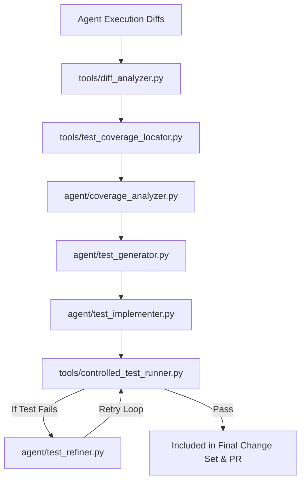

# Autonomous Test Generation in RepoMind

Enable RepoMind to infer behavioral changes from code modifications and generate targeted, runnable tests before creating a Pull Request.

---

## Overview

RepoMind Autonomous Test Generation automatically inspects code diffs produced during agent execution runs, maps changed symbols to existing test coverage, infers missing behavioral test cases, generates structured pytest specifications, executes them in a controlled subprocess, and iteratively refines failed test cases before finalizing changes.



---

## Core Components

1. **Diff & Behavioral Change Detection (`tools/diff_analyzer.py`)**
   - Parses code modifications into `BehaviorChangeSummary` capturing added/modified functions, classes, parameter signature changes, and risk levels.

2. **Existing Test Coverage Locator (`tools/test_coverage_locator.py`)**
   - Maps source files (e.g. `agent/executor.py`) to test files (e.g. `tests/test_agent.py`) and determines covered vs uncovered symbols via AST parsing.

3. **Behavioral Coverage Inference (`agent/coverage_analyzer.py`)**
   - Infers missing test requirements (`happy_path`, `error_handling`, `boundary_condition`, `async_execution`) for uncovered code.

4. **Structured Test Case Spec Generator (`agent/test_schemas.py`, `agent/test_generator.py`)**
   - Defines Pydantic schemas (`TestCaseSpec`, `TestSuiteSpec`) and generates structured test specifications via LLM structured outputs or deterministic fallback builder.

5. **Repository-Conforming Test Implementer (`agent/test_implementer.py`)**
   - Renders structured specs into clean, formatted pytest Python code matching repository style.

6. **Controlled Subprocess Test Runner (`tools/controlled_test_runner.py`)**
   - Executes pytest inside an isolated subprocess environment with controlled `PYTHONPATH` and timeout limits.

7. **Diagnostic Failure Refinement Loop (`agent/test_refiner.py`)**
   - Diagnoses test failures (import errors, assertion failures) and applies iterative fixes (up to 3 attempts) until tests pass.

8. **Agent Chain Integration (`agent/chain.py`)**
   - Automatically triggers autonomous test generation after code edits in `AgentChain.run_with_project_map`.

---

## Verification & Execution

To run the autonomous test generation test suite:
```bash
pytest tests/test_autonomous_test_generator.py -v
```
