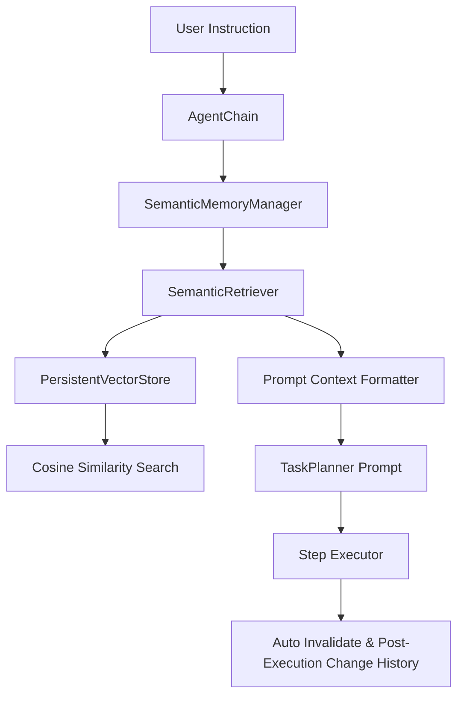

# RepoMind Persistent Semantic Memory

Give RepoMind persistent semantic memory so it can remember repository architecture, previous changes, decisions, conventions, and execution history across independent agent runs.

---

## Overview

RepoMind Persistent Semantic Memory provides repository-scoped durable knowledge storage and retrieval across independent agent runs. It maintains long-term contextual awareness of:
- **Architecture**: Structural layout, framework configurations, key entrypoints, and design patterns.
- **Conventions**: Coding style rules, linting constraints, and naming conventions.
- **Decisions**: Architectural decision records (ADRs), technical tradeoffs, and PR implementations.
- **Change History**: Historical agent execution steps, affected files, and change summaries.
- **Constraints**: Safety rules, non-negotiable invariants, and known pitfalls.

---

## Architecture & Data Flow



### Key Components

1. **`memory.models.RepositoryMemory`**
   - Data structure representing a durable memory item.
   - Includes fields for `repo_id`, `category`, `content`, `summary`, `file_paths`, `symbols`, `embedding`, `is_stale`, `version`, `access_count`, and timestamps.

2. **`memory.store.PersistentVectorStore`**
   - Manages per-repository filesystem vector storage (`.repomind_memory/repo_<repo_id>.json`).
   - Generates L2-normalized dense embeddings using an n-gram hashing vectorizer.
   - Implements Cosine Similarity nearest-neighbors search.

3. **`memory.retrieval.SemanticRetriever`**
   - Retrieves top-K memories for a query using composite relevance scoring:
     $$\text{Score} = 0.50 \cdot \text{VectorSim} + 0.25 \cdot \text{FileOverlap} + 0.15 \cdot \text{SymbolOverlap} + 0.10 \cdot \text{Recency/Access}$$

4. **`memory.lifecycle.MemoryLifecycleManager`**
   - Performs smart deduplication (>85% similarity merge).
   - Handles automatic stale-memory invalidation when target files are rewritten.

5. **`memory.manager.SemanticMemoryManager`**
   - Unified facade encapsulating storage, retrieval, lifecycle, and LLM prompt context injection under strict token budgeting.

---

## Integration Details

- **Planning Integration**: Before generating a plan, `AgentChain` queries `SemanticMemoryManager` for memories relevant to the instruction and files, formatting them into the planner system prompt.
- **Post-Execution Auto-Update**: Upon successfully applying file changes, `AgentChain` invalidates old memories linked to modified files and appends a `CHANGE_HISTORY` memory entry.
- **PR Decision Tracking**: Calling `record_pr_memory()` logs pull request metadata into persistent memory for future agent runs.

---

## Configuration

In `config/settings.py` or `.env`:
```env
MEMORY_STORAGE_DIR=.repomind_memory
MEMORY_DEDUP_THRESHOLD=0.85
```
